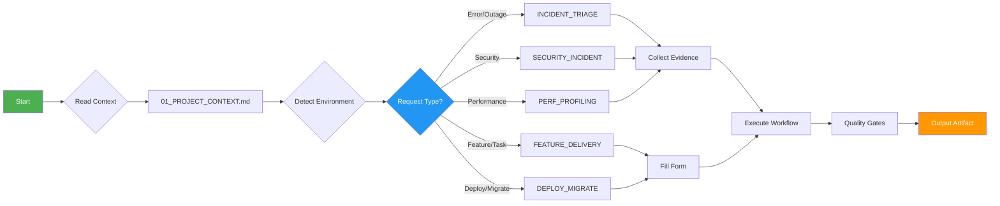

# ENTRYPOINT — Router

**Purpose:** Route all requests to the appropriate workflow
**When to use:** Every single request - this is your starting point
**Prerequisites:** None - start here always
**Outputs:** Workflow path to follow

---

## CRITICAL: Read This First

You are an agent working with this repo. Follow this router strictly.

### Before Routing - Validation Checklist

Agent MUST verify:
- [ ] I have read `01_PROJECT_CONTEXT.md` (not assumed values)
- [ ] I have detected the environment correctly
- [ ] I understand the user's request clearly
- [ ] I will state which route I'm taking before proceeding

**If any checkbox is unchecked, STOP and complete it first.**

## Quick Reference



## 0) Non-negotiables
- **PHI/PII safety is ON**: follow `policy/PHI_SAFE_LOGGING.md`.
- **Production is read-only**: follow `policy/PRODUCTION_POLICY.md`.
- **Evidence first**: always run/collect the relevant checklist before proposing fixes.
- **Quality gates**: before any "done", pass `gates/QUALITY_GATES.md` and `gates/AGENT_SELF_CHECK.md`.

## 1) Detect environment
1. Use `policy/ENV_DETECTION.md` to classify: `dev` / `staging` / `production`.
2. If uncertain → treat as **production**.

## 2) Pick a profile (default if unsure)
- `profiles/default.md` (balanced)
- `profiles/production_safe.md` (read-only, conservative)
- `profiles/aggressive_autofix.md` (dev/staging only)

## 3) Route by intent

### A) Incident / error / outage
**Triggers:** 502, 504, exception, crash, restart loop, timeout

Go to: `flows/INCIDENT_TRIAGE.md`
- First: fill `forms/INCIDENT_MIN.md` (minimum inputs)
- Then: collect evidence checklist per category (nginx/docker/systemd/migrations/perf)
- Then: run fix loop `flows/AUTOFIX_LOOP.md`

**Example:**
```
User: "fix this error: nginx returning 502"
→ flows/INCIDENT_TRIAGE.md
→ checklists/NGINX_502_EVIDENCE.md
→ workflows/nginx_502_504.md
```

### B) Feature / task / refactor
**Triggers:** implement, add feature, refactor, create, build

Go to: `workflows/feature_delivery.md`
- First: fill `forms/FEATURE_MIN.md`
- Then: follow `workflows/feature_delivery.md` with `testing/TEST_STRATEGY.md`

**Example:**
```
User: "implement feature: user authentication"
→ forms/FEATURE_MIN.md
→ workflows/feature_delivery.md
→ artifacts/PR_SUMMARY.md
```

### C) Deploy / maintenance / migration
**Triggers:** deploy, release, migrate, rollback, maintenance

Go to: `workflows/deploy_and_migrate.md`
- First: fill `forms/DEPLOY_MIN.md`
- Then: use `workflows/maintenance_mode.md` or `workflows/rollback_recovery.md` as needed

**Example:**
```
User: "deploy to staging with new migrations"
→ forms/DEPLOY_MIN.md
→ workflows/deploy_and_migrate.md
→ artifacts/RUNBOOK.md
```

### D) Security concern
**Triggers:** security, vulnerability, attack, injection, traversal

Go to: `workflows/security_incident.md`
- Use `security/BASELINE.md` and `skills/security_hardening.md`

**Example:**
```
User: "review logs for SQL injection patterns"
→ workflows/security_incident.md
→ workflows/security_sqli_path.md
→ artifacts/security_checklist.md
```

### E) Performance issue
**Triggers:** slow, latency, timeout, memory, CPU, performance

Go to: `workflows/performance_profiling.md`
- Use `checklists/PERF_REGRESSION_EVIDENCE.md`

**Example:**
```
User: "endpoint /api/users is slow"
→ checklists/PERF_REGRESSION_EVIDENCE.md
→ workflows/performance_profiling.md
→ artifacts/INCIDENT_REPORT.md
```

## 4) Outputs (artifacts)
When closing work, produce:
- Incident: `artifacts/INCIDENT_REPORT.md` (+ `artifacts/POSTMORTEM.md` if major)
- PR: `artifacts/PR_SUMMARY.md`
- Decisions: `artifacts/DECISION_RECORD.md` (ADR-lite)
- Deployment: `artifacts/RUNBOOK.md`

## 5) Reference map
Use `REFERENCE_MAP.md` for tags like `FLOW:INCIDENT_TRIAGE` or `SKILL:NGINX_502`.

## 6) Autofill-first rule (v4)
Agents MUST read `01_PROJECT_CONTEXT.md` → `AUTO_CONTEXT` and infer missing values using `autofill/PATH_AND_SERVICE_INFERENCE.md` before asking questions.

## Routing Confidence Check

**Before proceeding with any route, agent MUST:**

1. **State the route:** "I am routing this to [WORKFLOW_NAME] because [REASON]"
2. **Confirm confidence:** "Confidence level: [HIGH/MEDIUM/LOW]"
3. **If confidence is LOW:** Ask user to confirm before proceeding

### Routing Decision Matrix

| User Request Contains | Primary Route | Confidence Check |
|----------------------|---------------|------------------|
| error, 502, 504, crash, exception | `flows/INCIDENT_TRIAGE.md` | Check logs exist |
| implement, feature, add, create | `workflows/feature_delivery.md` | Check requirements clear |
| deploy, release, migrate | `workflows/deploy_and_migrate.md` | Check environment known |
| security, attack, injection | `workflows/security_incident.md` | Check severity |
| slow, latency, performance | `workflows/performance_profiling.md` | Check metrics available |

---

## Fallback Handling

### If No Route Matches

**DO NOT GUESS.** Follow this procedure:

1. **Analyze request type:**
   - Is it a question? → Answer directly, no workflow needed
   - Is it a problem? → Default to `flows/INCIDENT_TRIAGE.md`
   - Is it a task? → Default to `workflows/feature_delivery.md`
   - Still unclear? → Ask user to clarify

2. **State your reasoning:**
   ```
   "I cannot confidently match this request to a workflow.
   Request appears to be: [QUESTION/PROBLEM/TASK/UNCLEAR]
   Suggested route: [ROUTE] or [ASK FOR CLARIFICATION]
   "
   ```

3. **Never proceed without confidence**

---

## Troubleshooting

### Can't determine which workflow to use?
1. **First:** Re-read the user's request carefully
2. **Second:** Check `ROUTING_RULES.md` for keyword matching
3. **Third:** Look at `TAXONOMY.md` for error classification
4. **Fourth:** Ask user: "Is this an incident, feature request, or deployment?"
5. **Never:** Guess or assume

**Default routes (only if confident):**
- Errors/problems → `flows/INCIDENT_TRIAGE.md`
- Features/tasks → `workflows/feature_delivery.md`
- Questions → Answer directly

### Missing project context?
1. **Required:** Read `01_PROJECT_CONTEXT.md` first (not optional)
2. **If incomplete:** Use `autofill/PATH_AND_SERVICE_INFERENCE.md` to infer
3. **If still missing critical info:** Use `forms/PROJECT_CONTEXT_MIN.md`
4. **Never:** Proceed with assumed values

### Uncertain about environment?
1. **Check:** `policy/ENV_DETECTION.md` for detection rules
2. **Validate:** Confirm detected environment with user if uncertain
3. **Safety rule:** When in doubt → treat as **production** (read-only)
4. **Never:** Assume development environment

### Need to skip a step?

**NEVER skip:**
- ❌ Evidence collection for incidents
- ❌ Quality gates before completion
- ❌ PHI/PII redaction
- ❌ Reading `01_PROJECT_CONTEXT.md`
- ❌ Environment detection

**Can skip (if conditions met):**
- ✅ Forms if context is complete
- ✅ Autofill if all values provided
- ✅ Examples if workflow is clear

---

## Hallucination Prevention

### Before Proceeding to Any Workflow

Agent MUST verify:

```markdown
## Pre-Flight Checklist
- [ ] I have READ (not assumed) the actual content of 01_PROJECT_CONTEXT.md
- [ ] I have CONFIRMED (not guessed) the environment
- [ ] I have STATED which workflow I'm using
- [ ] I have VALIDATED my routing decision
- [ ] I can CITE specific evidence for my choice

If any item is unchecked: STOP and complete it.
```

### Red Flags - Stop Immediately If:

- 🚩 You're about to assume a value you haven't read
- 🚩 You're guessing which workflow to use
- 🚩 You're proceeding without reading context
- 🚩 You're unsure but proceeding anyway
- 🚩 You can't cite specific evidence for your decision

**If you see any red flag: STOP, ask for clarification, do not proceed.**

