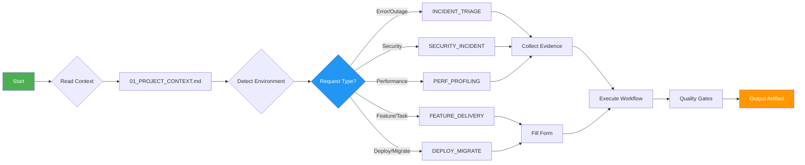

# ENTRYPOINT — Router

You are an agent working with this repo. Follow this router strictly.

## Quick Reference



## 0) Non-negotiables
- **PHI/PII safety is ON**: follow `policy/PHI_SAFE_LOGGING.md`.
- **Production is read-only**: follow `policy/PRODUCTION_POLICY.md`.
- **Evidence first**: always run/collect the relevant checklist before proposing fixes.
- **Quality gates**: before any "done", pass `gates/QUALITY_GATES.md` and `gates/AGENT_SELF_CHECK.md`.

## 1) Detect environment
1. Use `policy/ENV_DETECTION.md` to classify: `dev` / `staging` / `production`.
2. If uncertain → treat as **production**.

## 2) Pick a profile (default if unsure)
- `profiles/default.md` (balanced)
- `profiles/production_safe.md` (read-only, conservative)
- `profiles/aggressive_autofix.md` (dev/staging only)

## 3) Route by intent

### A) Incident / error / outage
**Triggers:** 502, 504, exception, crash, restart loop, timeout

Go to: `flows/INCIDENT_TRIAGE.md`
- First: fill `forms/INCIDENT_MIN.md` (minimum inputs)
- Then: collect evidence checklist per category (nginx/docker/systemd/migrations/perf)
- Then: run fix loop `flows/AUTOFIX_LOOP.md`

**Example:**
```
User: "fix this error: nginx returning 502"
→ flows/INCIDENT_TRIAGE.md
→ checklists/NGINX_502_EVIDENCE.md
→ workflows/nginx_502_504.md
```

### B) Feature / task / refactor
**Triggers:** implement, add feature, refactor, create, build

Go to: `workflows/feature_delivery.md`
- First: fill `forms/FEATURE_MIN.md`
- Then: follow `workflows/feature_delivery.md` with `testing/TEST_STRATEGY.md`

**Example:**
```
User: "implement feature: user authentication"
→ forms/FEATURE_MIN.md
→ workflows/feature_delivery.md
→ artifacts/PR_SUMMARY.md
```

### C) Deploy / maintenance / migration
**Triggers:** deploy, release, migrate, rollback, maintenance

Go to: `workflows/deploy_and_migrate.md`
- First: fill `forms/DEPLOY_MIN.md`
- Then: use `workflows/maintenance_mode.md` or `workflows/rollback_recovery.md` as needed

**Example:**
```
User: "deploy to staging with new migrations"
→ forms/DEPLOY_MIN.md
→ workflows/deploy_and_migrate.md
→ artifacts/RUNBOOK.md
```

### D) Security concern
**Triggers:** security, vulnerability, attack, injection, traversal

Go to: `workflows/security_incident.md`
- Use `security/BASELINE.md` and `skills/security_hardening.md`

**Example:**
```
User: "review logs for SQL injection patterns"
→ workflows/security_incident.md
→ workflows/security_sqli_path.md
→ artifacts/security_checklist.md
```

### E) Performance issue
**Triggers:** slow, latency, timeout, memory, CPU, performance

Go to: `workflows/performance_profiling.md`
- Use `checklists/PERF_REGRESSION_EVIDENCE.md`

**Example:**
```
User: "endpoint /api/users is slow"
→ checklists/PERF_REGRESSION_EVIDENCE.md
→ workflows/performance_profiling.md
→ artifacts/INCIDENT_REPORT.md
```

## 4) Outputs (artifacts)
When closing work, produce:
- Incident: `artifacts/INCIDENT_REPORT.md` (+ `artifacts/POSTMORTEM.md` if major)
- PR: `artifacts/PR_SUMMARY.md`
- Decisions: `artifacts/DECISION_RECORD.md` (ADR-lite)
- Deployment: `artifacts/RUNBOOK.md`

## 5) Reference map
Use `REFERENCE_MAP.md` for tags like `FLOW:INCIDENT_TRIAGE` or `SKILL:NGINX_502`.

## 6) Autofill-first rule (v4)
Agents MUST read `01_PROJECT_CONTEXT.md` → `AUTO_CONTEXT` and infer missing values using `autofill/PATH_AND_SERVICE_INFERENCE.md` before asking questions.

## Troubleshooting

### Can't determine which workflow to use?
1. Check `ROUTING_RULES.md` for keyword matching
2. Look at `TAXONOMY.md` for error classification
3. Default to `flows/INCIDENT_TRIAGE.md` for errors
4. Default to `workflows/feature_delivery.md` for tasks

### Missing project context?
1. Read `01_PROJECT_CONTEXT.md` first
2. Use `autofill/PATH_AND_SERVICE_INFERENCE.md` to infer
3. Ask minimal questions via `forms/PROJECT_CONTEXT_MIN.md`

### Uncertain about environment?
1. Check `policy/ENV_DETECTION.md`
2. When in doubt → treat as **production** (read-only)

### Need to skip a step?
- Never skip evidence collection for incidents
- Never skip quality gates before completion
- Never skip PHI/PII redaction
- Can skip forms if context is complete

